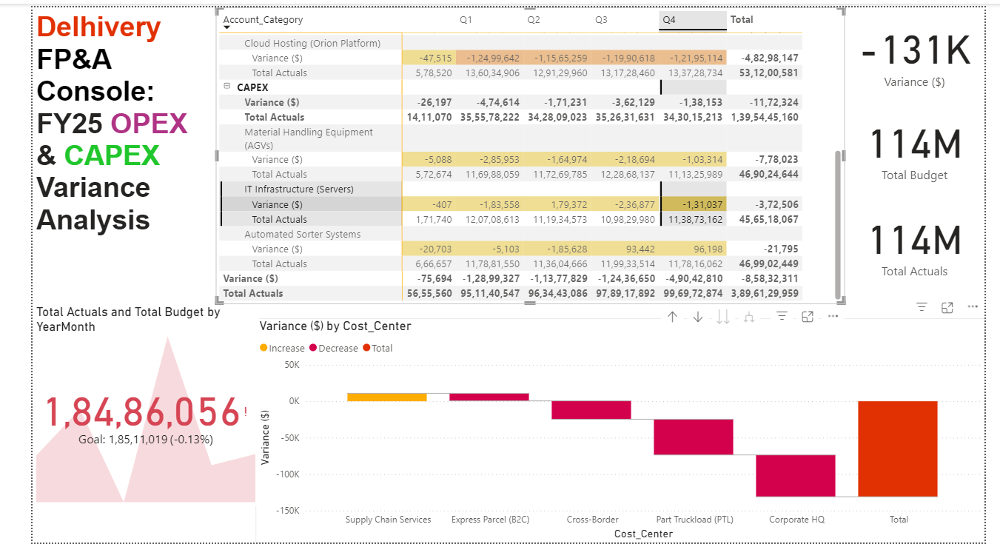

# Delhivery FP&A Cost Variance Analysis

**Author:** Kundan Singh  
**Focus:** Corporate Finance & Pricing Strategy

---

## Why I Built This

I wanted to practice transaction-level variance analysis specifically for the logistics industry. Real General Ledger (GL) data is always locked behind NDAs, so I didn't want to just grab a generic dataset from Kaggle. 

Instead, I wrote a custom Python script to build a 15,000-row simulated General Ledger. It mirrors the asset-light business model used by logistics firms like Delhivery, breaking down costs across Express Parcel (B2C) and Part Truckload (PTL) segments.

---

## Technical Setup

* **Data Engineering (Python):** Generated 15,000 GL transactions with randomized dates, cost centers, and categories. I intentionally coded a Q3 line-haul fuel price spike into the PTL segment to see if my dashboard logic would catch it.
* **Data Modeling:** Structured a star schema in Power BI mapping raw GL account codes directly to operational cost centers.
* **DAX Logic:** Wrote custom DAX measures for YTD actuals, budget baselines, and net variance percentage.
* **Dashboard Design:** Built an EBITDA waterfall chart to spot where money was spilling over, alongside a compact matrix table for line-item review.

---

## Dashboard Preview

---

## Main Takeaway

The simulation caught a 25%+ OPEX overrun in the Part Truckload (PTL) segment during Q3. This was driven almost entirely by the programmed fuel price spike in line-haul transportation. 

**Quick Recommendations:**
1. **Commercial Contracts:** Put fuel pass-through clauses into Q4 PTL contracts to protect against fuel price volatility.
2. **Operations:** Move CAPEX investment toward automated sorters to lower long-term reliance on contract labor.

---

## Files in this Repo

* `delhivery_fpa_variance_model.pbix` – Full Power BI file.
* `executive_summary_fpa_variance.pdf` – One-page executive memo.
* `dataset_generator.py` – Python script that built the data.
* `simulated_gl_data.csv` – Raw 15,000-row dataset.
